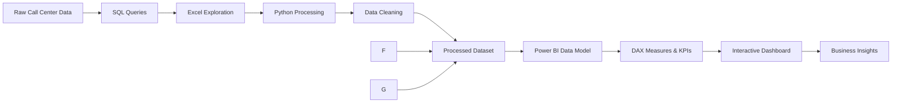
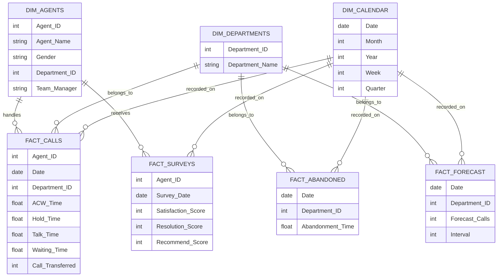

# Call Center Performance Analytics Dashboard

---

## 1. **Project Overview**

Call centers generate large volumes of operational data, including call logs, handling times, agent activity, and customer feedback.  

This project transforms raw call center data into actionable insights by building a **data analytics pipeline** and an interactive **Power BI dashboard**.  

**Tools Used:**

* **SQL** – Querying and extracting data  
* **Python (Pandas)** – Data cleaning    
* **Excel** – Initial exploration and validation  
* **Power BI** – Data modeling, DAX calculations, interactive dashboards  

---

## 2. **Project Objective**

The main goal is to build a **data-driven performance monitoring system** for call center operations that enables stakeholders to:

* Monitor **call center operational performance**  
* Track **answered vs abandoned calls**  
* Evaluate **agent productivity**  
* Analyze **customer satisfaction metrics (CSAT, NPS)**  
* Compare **forecasted vs actual call volumes**  
* Enable **interactive exploration** of operational data  

---

## 3. **Key Stakeholders**

The system is designed for:

* **Call Center Managers** – Monitor operational KPIs  
* **Operations Teams** – Track efficiency and resource allocation  
* **Customer Experience Teams** – Analyze satisfaction trends  
* **Business Analysts** – Generate insights and reports  

---

## 4. **Key Performance Indicators (KPIs)**

The dashboard calculates and tracks:

* **Total Calls**  
* **Answered Calls**  
* **Abandoned Calls**  
* **Average Handling Time (AHT)**  
* **Customer Satisfaction Score (CSAT)**  
* **Net Promoter Score (NPS)**  
* **Call Transfers**  
* **Actual vs Forecast Performance**  

---

## 5. **System Architecture**

The project follows a **multi-layer analytics pipeline**:



### Architecture Layers

**1. Data Source Layer**

* Raw call center dataset containing call records, agent data, handling time, and satisfaction metrics.

**2. Data Processing Layer**

* SQL for querying data
* Excel for initial exploration
* Python for cleaning and feature engineering

**3. Analytics Layer**

* Data modeling in Power BI
* KPI calculations using DAX

**4. Visualization Layer**

* Interactive Power BI dashboard
* KPI monitoring
* Performance insights
These visualizations allow decision makers to analyze **call center performance efficiently**.
---

## 6. **System Analysis**

### 6.1 **Input Data**

| Attribute | Description |
|----------|-------------|
| Call ID | Unique identifier for each call |
| Call Date | Date of the call |
| Call Time | Time interval when the call occurred |
| Agent Name | Agent handling the call |
| Team Manager | Manager supervising the agent |
| Department | Department responsible for the call |
| Call Status | Indicates whether the call was answered or abandoned |
| Handling Time | Duration of the call |
| Customer Satisfaction Score | Customer feedback rating |
| Forecasted Calls | Predicted call volume |
| Actual Calls | Actual call volume |

---

### 6.2 **System Processing**

The system performs several processing operations including:

- Data cleaning and validation
- Aggregation of performance metrics
- KPI calculations
- Time-based performance analysis

---

### 6.3 **System Outputs**

The system generates **interactive dashboards** that display:

- Key Performance Indicators (**KPIs**)
- Call center performance trends
- Agent productivity comparisons
- Call distribution analysis
- Customer satisfaction metrics

---
## 6.4 **Entity Relationship Diagram(ERD)**

The dataset follows a **galaxy Schema data model** .


---
## **7 Algorithms**
## **7.1 Analytical Metrics**

**Abandonment Rate**  
`Abandonment Rate = Abandoned Calls / Total Calls`  

**Average Handling Time (AHT)**  
`AHT = Total Handling Time / Answered Calls`  

**Forecast Accuracy**  
`Forecast Accuracy = Actual Calls / Forecasted Calls`  

---
## 7.2 **Key DAX Measures**

### **Total Calls**

```DAX
Total Calls =
COUNT(CallCenter[CallID])
```

### **Answered Calls**

```DAX
Answered Calls =
CALCULATE(
    COUNT(CallCenter[CallID]),
    CallCenter[CallStatus] = "Answered"
)
```

### **Abandoned Calls**

```DAX
Abandoned Calls =
CALCULATE(
    COUNT(CallCenter[CallID]),
    CallCenter[CallStatus] = "Abandoned"
)
```

### **Abandonment Rate**

```DAX
Abandonment Rate =
DIVIDE([Abandoned Calls], [Total Calls], 0)
```

### **Average Handling Time**

```DAX
Average Handling Time =
AVERAGE(CallCenter[HandlingTime])
```

### **Customer Satisfaction Score**

```DAX
CSAT Score =
AVERAGE(CallCenter[CustomerSatisfaction])
```

---

## 8. **Repository Structure**

```
call-center-performance-dashboard

data
   raw_data.xlsx
   processed_data.csv

python
   data_cleaning.py

sql
   queries.sql

powerbi
   call_center_dashboard.pbix


README.md
```

---

## 9. **Expected Insights**

The dashboard helps decision makers to:

- Identify **high performing agents**
- Detect **call abandonment patterns**
- Monitor **customer satisfaction trends**
- Analyze **call volume trends**
- Improve **workforce planning**
