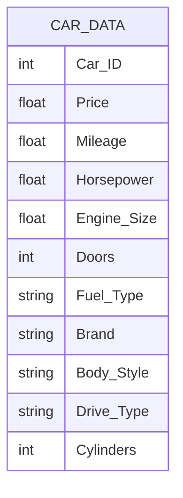

# The Effect of Quantitative and Qualitative Variables on Car Prices

---

## 1. Project Overview

Car pricing is influenced by a combination of quantitative variables such as mileage, engine size, and horsepower, as well as qualitative variables such as fuel type, car brand, and body style.

This project investigates how both quantitative and qualitative factors affect car prices using statistical analysis and multiple linear regression techniques. The analysis aims to identify the most significant variables influencing vehicle pricing and quantify their impact on market value. The project applies exploratory data analysis, statistical modeling, and regression analysis to generate actionable insights for decision-making.

**Tools Used:**

* Python
* Pandas
* NumPy
* Matplotlib
* Seaborn
* Statsmodels
* Scikit-learn
* Excel

---

## 2. Project Objective

The main objective of this project is to analyze the relationship between car prices and various quantitative and qualitative variables in order to:

* Identify significant factors affecting vehicle prices
* Measure the impact of numerical variables on pricing
* Evaluate the influence of categorical variables
* Build a Multiple Linear Regression model
* Assess model performance and explanatory power
* Generate data-driven insights for pricing analysis

---

## 3. Key Stakeholders

The analysis can support:

* Automotive Market Analysts
* Car Dealers
* Vehicle Pricing Teams
* Business Analysts
* Data Analysts
* Researchers in Automotive Economics

---

## 4. Research Questions

The project answers several analytical questions:

* Which quantitative variables significantly affect car prices?
* Which qualitative variables have the strongest influence on pricing?
* How much variation in price can be explained by the selected variables?
* What is the combined effect of quantitative and qualitative variables on vehicle price?
* Which factors increase or decrease the predicted price?

---

## 5. System Architecture


### Architecture Layers

#### 1. Data Source Layer

* Car specifications dataset
* Vehicle pricing information
* Quantitative and qualitative attributes

#### 2. Data Preparation Layer

* Missing value handling
* Data validation
* Feature transformation
* Categorical variable encoding

#### 3. Statistical Analysis Layer

* Correlation analysis
* Regression modeling
* Significance testing

#### 4. Insight Generation Layer

* Variable importance analysis
* Price impact interpretation
* Business recommendations

---

## 6. System Analysis

### 6.1 Input Data

| Variable        | Description                |
| --------------- | -------------------------- |
| Price           | Vehicle selling price      |
| Mileage         | Distance driven by vehicle |
| Horsepower      | Engine power               |
| Engine Size     | Engine capacity            |
| Number of Doors | Number of vehicle doors    |
| Fuel Type       | Type of fuel used          |
| Car Brand       | Manufacturer name          |
| Body Style      | Vehicle body category      |
| Drive Type      | Vehicle drivetrain         |
| Cylinders       | Number of engine cylinders |

---

### 6.2 Data Processing

The analysis includes:

* Data cleaning and preprocessing
* Exploratory Data Analysis (EDA)
* Outlier detection
* Correlation analysis
* Dummy variable creation for categorical features
* Multiple Linear Regression modeling
* Statistical significance testing

---

### 6.3 Output Results

The system produces:

* Correlation matrices
* Regression summaries
* Variable significance reports
* Coefficient interpretation
* Predicted vs Actual Price comparisons
* Statistical insights and recommendations

---

## 6.4 Conceptual Data Model



---

## 7. Methodology

### 7.1 Exploratory Data Analysis

The project examines:

* Distribution of vehicle prices
* Relationships between numerical variables
* Price variation across categories
* Correlation patterns

---

### 7.2 Multiple Linear Regression

The analysis uses Multiple Linear Regression to estimate the relationship between independent variables and vehicle price. Quantitative variables are used directly, while qualitative variables are converted into dummy variables before model fitting.

---

## 8. Statistical Metrics

### R-Squared

Measures the percentage of price variation explained by the model.

### Adjusted R-Squared

Evaluates model performance while accounting for the number of predictors.

### P-Value

Determines whether a variable significantly affects car prices.

### Coefficient Estimates

Measure the direction and magnitude of each variable's impact on price.

---

## 9. Repository Structure

```text
The-effect-of-quantitative-and-qualitative-variables-on-the-price-of-the-car

data
    car_dataset.xlsx

notebooks
    Car_Price_Analysis.ipynb

reports
    statistical_report.pdf

images
    visualizations

README.md
```

---

## 10. Key Insights

The analysis helps identify:

* Variables that significantly influence car prices
* Most valuable vehicle characteristics
* Impact of categorical factors such as fuel type and brand
* Relationships between mileage, engine specifications, and price
* Key drivers of vehicle valuation

---

## 11. Business Impact

The findings can support:

* Vehicle pricing strategies
* Market analysis
* Car valuation processes
* Inventory management decisions
* Automotive market research

---
